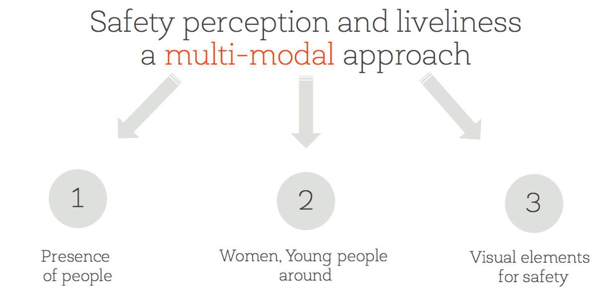

# Are Safer Looking Neighborhoods More Lively? A Multimodal Investigation into Urban Life



  
This repository shows the code to apply the concept of "Are Safer Looking Neighborhoods More Lively? A Multimodal Investigation into Urban Life". Through the code it is possible to reproduce some results, and to see how security perception can be predicted from Google Street View images, automatically. 
  
See the [paper](https://arxiv.org/abs/1608.00462) and the [slides](https://speakerdeck.com/denadai2/are-safer-looking-neighborhoods-more-lively-a-multimodal-investigation-into-urban-life) for more details.


## Overview
* [data/](data) contains the list of the coordinates of the Google Street View images we used to train our network.
* [figures/](figures) is the output directory of the images generated by the scripts.
* [generated_files/](generated_files) contains the trained models of pytorch.
* [caffe/](caffe) contains the original caffe model we used for the paper.

Please consider citing our [paper](https://arxiv.org/abs/1608.00462) if you use our model or code (see below for citation). We live thanks to this small action you can take!

## Installation

We assume that you're using [Python 3.6](https://www.python.org/downloads/).

Then we assume these Python package dependencies:
* [torch](http://pytorch.org/) 0.4.0
* [torchvision](http://pytorch.org/) 0.2.0
* [Pillow](https://pillow.readthedocs.io/en/5.1.x/) 5.1.0
* [jupyter](http://jupyter.org/)

## Data


### Street View images
Unfortunately, we can not share the original Street View images we used to train and test the model. However, we extracted all the images and we predicted the score for all the images. The latitude, longitude and the prediction for each image can be found in `data/list_files.csv`

### Model weights and definition

We shared the model of [Caffe](http://caffe.berkeleyvision.org/model_zoo.html) and [PyTorch](http://pytorch.org/). The former can be found in `caffe/`, while the latter can be loaded from the state dictionary (`pytorch_state.npy`) or the full model (`pytorch_model.pt`).

Download them here:
* [Caffe weights](https://doi.org/10.6084/m9.figshare.6131156), `places205CNN_finetune_snap_iter_10000.caffemodel_save` from figshare
* [PyTorch state dict](https://doi.org/10.6084/m9.figshare.6131156), `pytorch_state.npy` from figshare
* [PyTorch full loadable model](https://doi.org/10.6084/m9.figshare.6131156), `pytorch_model.pt` from figshare

The pre-processing of the images involves the subtraction of the mean. Thus, we included the means in format (3xWxH) in `generated_files/places205CNN_mean_filtered.npy`.

### Mobile phone data

Sadly, we can't share the mobile phone dataset we used. However, there are [similar dataset released in Open Data license](https://www.nature.com/articles/sdata201555).


## Disclaimer 
This code has been published after the peer-reviewed publication (1 year after it), to publish the code for new developers and researchers. Thus, we chose to share a PyTorch model. This allows to have an updated version of the code and weights, which can be used by today's researchers.

The original Caffe model was converted through [MMdnn](https://github.com/Microsoft/MMdnn) with these steps:

```bash
python -m mmdnn.conversion._script.convertToIR -f caffe -d kit_imagenet -n places205CNN_finetune.prototxt -w places205CNN_finetune_snap_iter_10000.caffemodel_save

python -m mmdnn.conversion._script.IRToCode --dstFramework pytorch --IRModelPath pytorch_places2_IR.pb --IRWeightPath pytorch_places2_IR.npy --dstModelPath pytorch_places.py -dw pytorch_places2_IR.npy

python -m mmdnn.conversion.examples.pytorch.imagenet_test -n pytorch_places.py -w pytorch_state.npy --dump pytorch_model.pt
```

I will soon share the code to make the "attention" images (converting the original Matlab code), and the code to produce the plots of the paper. Although I improved the original code A LOT with new software and scripts that have been released in this year, it has not been optimized for efficiency, but should be fast enough for most purposes. We do not give any guarantees that there are no bugs - use the code on your own responsibility!

## License
This code is licensed under the MIT license. 


## Citation
```
@inproceedings{DeNadai:2016:SLN:2964284.2964312,
 author = {De Nadai, Marco and Vieriu, Radu Laurentiu and Zen, Gloria and Dragicevic, Stefan and Naik, Nikhil and Caraviello, Michele and Hidalgo, Cesar Augusto and Sebe, Nicu and Lepri, Bruno},
 title = {Are Safer Looking Neighborhoods More Lively?: A Multimodal Investigation into Urban Life},
 booktitle = {Proceedings of the 2016 ACM on Multimedia Conference},
 series = {MM '16},
 year = {2016},
 isbn = {978-1-4503-3603-1},
 location = {Amsterdam, The Netherlands},
 pages = {1127--1135},
 numpages = {9},
 url = {http://doi.acm.org/10.1145/2964284.2964312},
 doi = {10.1145/2964284.2964312},
 acmid = {2964312},
 publisher = {ACM},
 address = {New York, NY, USA},
 keywords = {computer vision, mobile phone data, social studies, urban perception, urban planning},
} 
```


